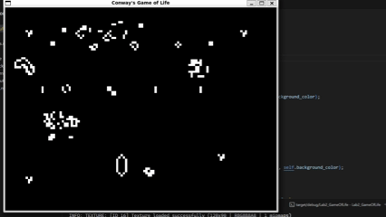

# GPC-Lab2-GameOfLife

Implementación del autómata celular "Juego de la Vida" creado por John Horton Conway, desarrollado en Rust usando la biblioteca Raylib.



## Características

- Implementa todas las reglas clásicas del Juego de la Vida
- Incluye patrones predefinidos:
  - Still lifes (bloque, colmena, hogaza, bañera)
  - Osciladores (parpadeador, sapo, pulsar)
  - Naves espaciales (planeador, LWSS)
  - Patrones complejos

## Requisitos

- Rust (última versión estable)
- Bibliotecas de desarrollo de Raylib

## Instalación

1. Clona el repositorio:
   ```bash
   git clone https://github.com/AleWWH1104/GPC-Lab2-GameOfLife.git
   cd GPC-Lab2-GameOfLife

2. Ejecutar el programa:
   ```bash
   cargo run

 
   